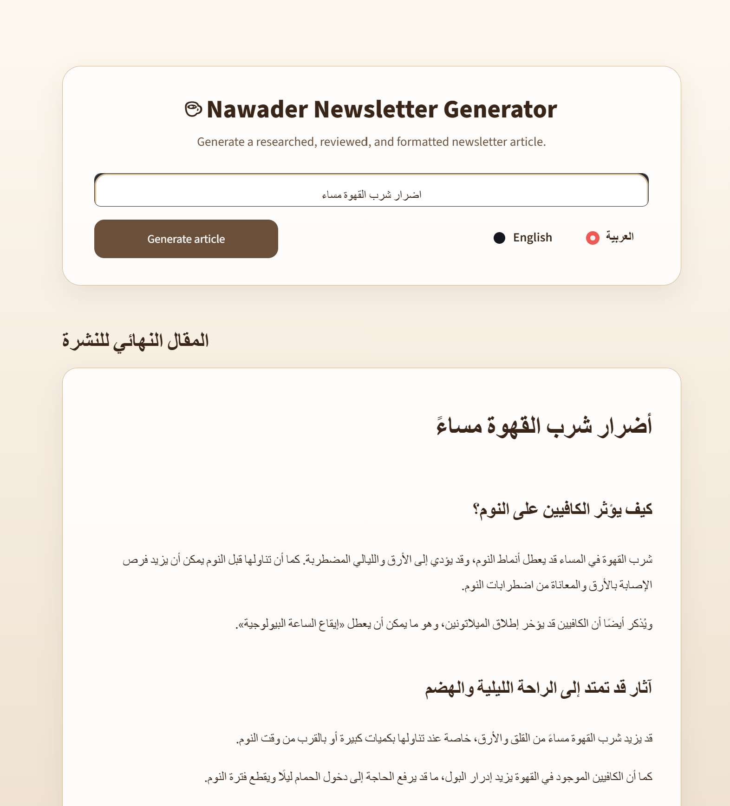
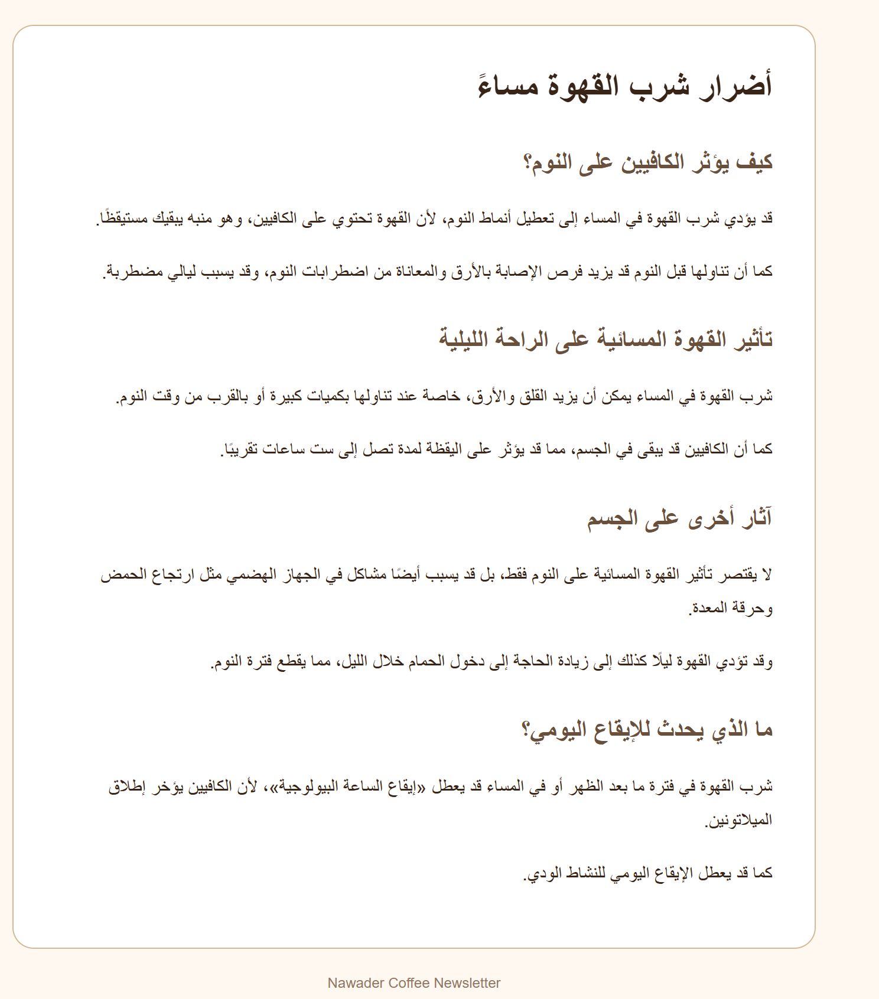
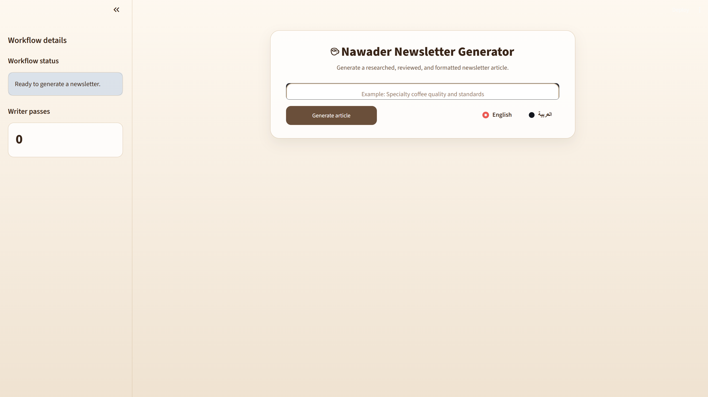

# Nawader Newsletter Generator

A multi-agent newsletter writing system built with **LangGraph**, **FastAPI**, **Streamlit**, live web search, and an OpenAI language model.

The system researches a topic, writes an article, reviews it through a reflection loop, formats the final result, and allows the user to export it in multiple formats.

---

## Key Features

- Live external research using Tavily
- Multi-agent workflow built with LangGraph
- Writer–Editor reflection loop
- Maximum of three Writer passes to guarantee termination
- Real-time workflow status streamed to the Streamlit sidebar
- Live Writer pass counter
- English and Arabic article generation
- Correct LTR and RTL article layout
- Final article export as Markdown, HTML email, PDF, or plain text
- Download controls appear only after article generation is complete
- FastAPI backend and Streamlit frontend communicate through HTTP

---

## Workflow

```text
START
  |
  v
Researcher
  |
  v
Writer
  |
  v
Editor
  |
  +---- APPROVED --------------------+
  |                                  |
  +---- REJECTED and passes < 3 ---> Writer
  |                                  |
  +---- REJECTED and passes == 3 ----+
                                     |
                                     v
                                  Formatter
                                     |
                                     v
                                    END
```

### Researcher

The only node allowed to bring outside information into the workflow.

It:

- Receives the topic
- Runs a live web search
- Extracts short factual research notes
- Writes no article prose
- Gives no opinions

### Writer

Creates the article using only the Researcher's notes.

It:

- Does not invent names, companies, brands, numbers, dates, or quotations
- Uses the selected output language
- Reads the Editor's critique during revision passes
- Returns a complete revised article after every rejection

### Editor

Acts as the critic in the reflection loop.

It evaluates:

- Factual grounding
- Neutral and newsworthy tone
- Brand relevance to Nawader Coffee

It returns:

- `APPROVED` or `REJECTED`
- A concrete critique when rejecting

### Formatter

Produces the final readable Markdown article.

It may:

- Add one headline
- Add subheadings
- Divide long text into short paragraphs
- Improve spacing and structure

It must not add, remove, or change facts.

---

## Project Structure

```text
project/
|
|-- api/
|   `-- main.py
|
|-- graph/
|   |-- state.py
|   |-- prompts.py
|   |-- nodes.py
|   `-- build_graph.py
|
|-- assets/
|   `-- style.css
|
|-- export_utils.py
|-- streamlit_app.py
|-- requirements.txt
|-- .env
`-- README.md
```

---

## Shared LangGraph State

```python
class NewsletterState(TypedDict):
    topic: str
    language: Literal["en", "ar"]
    research_notes: list[str]
    current_draft: str
    critique: str
    status: Literal["APPROVED", "REJECTED"]
    revision_count: int
    article_markdown: str
```

---

## Requirements

- Python 3.11 or newer
- OpenAI API key
- Tavily API key
- Internet connection for live search
- A Unicode font installed on the operating system for PDF export

On Windows, the PDF exporter can use fonts from:

```text
C:\Windows\Fonts
```

---

## Installation

### 1. Create a virtual environment

```powershell
python -m venv .venv
```

### 2. Activate it

Windows PowerShell:

```powershell
.\.venv\Scripts\Activate.ps1
```

Windows Command Prompt:

```cmd
.venv\Scripts\activate
```

macOS or Linux:

```bash
source .venv/bin/activate
```

### 3. Install dependencies

```powershell
pip install -r requirements.txt
```

---

## Environment Variables

Create a `.env` file in the project root:

```env
OPENAI_API_KEY=your_openai_api_key
OPENAI_MODEL=gpt-5.4-mini

TAVILY_API_KEY=your_tavily_api_key

NEWSLETTER_API_URL=http://127.0.0.1:8000/generate-stream
```

Do not commit the `.env` file to a public repository.

Recommended `.gitignore` entries:

```gitignore
.env
.venv/
__pycache__/
*.pyc
.streamlit/
```

---

## Run the Application

Open two terminal windows.

### Terminal 1: Start FastAPI

```powershell
uvicorn api.main:app --reload
```

The API runs at:

```text
http://127.0.0.1:8000
```

FastAPI documentation:

```text
http://127.0.0.1:8000/docs
```

### Terminal 2: Start Streamlit

```powershell
streamlit run streamlit_app.py
```

---

## Streaming API

### Endpoint

```http
POST /generate-stream
```

### Request body

```json
{
  "topic": "How coffee packaging helps preserve freshness",
  "language": "en"
}
```

Supported languages:

```text
en = English
ar = Arabic
```

### Progress event

```json
{
  "type": "progress",
  "node": "writer",
  "message": "Writer pass 1 complete. Editor is reviewing...",
  "level": "info",
  "revision_count": 1
}
```

### Final result event

```json
{
  "type": "result",
  "data": {
    "article_markdown": "# Final article",
    "research_notes": [],
    "revision_count": 2,
    "final_status": "APPROVED",
    "final_critique": ""
  }
}
```

Possible final statuses:

```text
APPROVED
REVISION_CAP_REACHED
```

---

## Reflection and Safety Cap

The Editor may reject a draft and return a critique.

The Writer then:

1. Reads the critique
2. Revises the complete article
3. Returns it to the Editor

Router logic:

```python
if status == "APPROVED":
    return "formatter"

if revision_count >= 3:
    return "formatter"

return "writer"
```

This prevents an infinite Writer–Editor loop.

The workflow should not depend on hard-coded topics, forced approvals, or test-only rejections.



---

## Language Support

The user selects either English or Arabic.

Display direction:

```text
English article -> LTR -> left aligned
Arabic article  -> RTL -> right aligned
```

The Formatter keeps the same language and does not translate the draft.

---

## Export Options

After the article is complete, the sidebar displays four formats:

- Markdown (`.md`)
- HTML email (`.html`)
- PDF (`.pdf`)
- Plain text (`.txt`)

The user can select one format, download it, then select another format and download again without regenerating the article.

Arabic PDF generation uses:

- `fpdf2`
- `uharfbuzz`
- A Unicode system font



---

## Frontend Behavior

The Streamlit interface contains:

- Title and subtitle inside the form
- Topic input
- Generate button
- English and Arabic radio buttons
- Fixed workflow sidebar
- Real-time workflow status
- Real-time Writer pass count
- Final article directly below the form
- Research notes expander
- Final Editor critique expander
- Export controls after completion

The generated result is stored in `st.session_state`, so changing the export format does not remove the article.



---

## Error Handling

The application handles:

- Empty topic input
- FastAPI connection failures
- Request timeouts
- Invalid streaming events
- Workflow errors
- Missing final results
- Export failures
- Missing Unicode PDF fonts

---

## Important Notes

- Only the Researcher should access external information.
- The Writer must use only the gathered research notes.
- The Editor must compare the draft against those notes.
- The Formatter must not change facts.
- The graph should be compiled once and reused by the API.
- The Streamlit frontend should call FastAPI through HTTP and must not import the LangGraph workflow directly.
- Test evidence and final screenshots can be added when the project is finalized.
